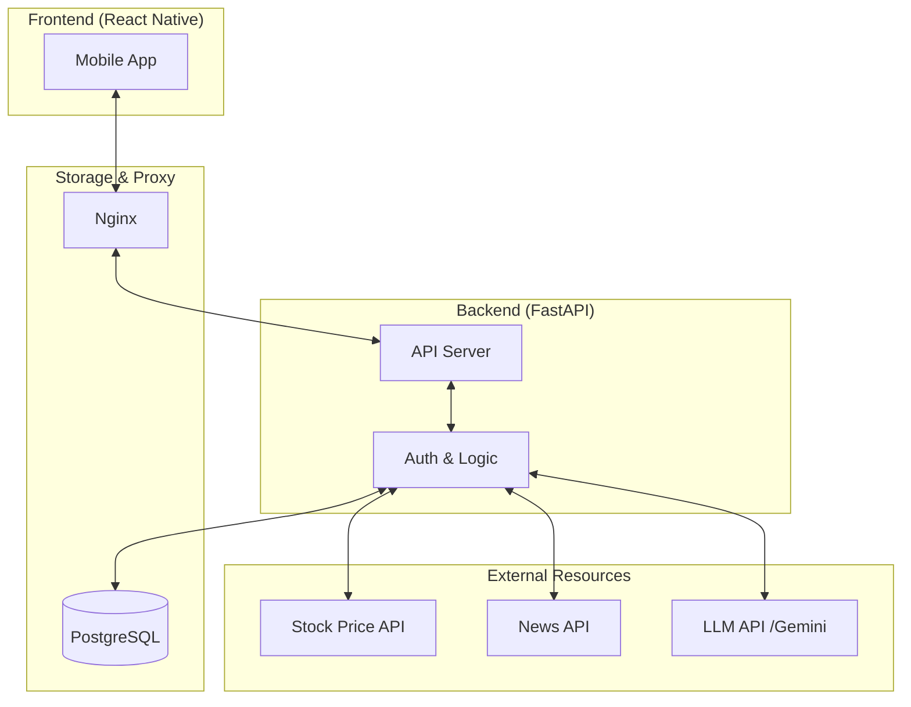

# StockFlow (스마트 투자 나침반)

주린이도 한눈에 자산을 파악하고, AI의 도움을 받아 똑똑한 투자 결정을 내릴 수 있도록 돕는 주식 대시보드 프로젝트입니다.

## 🎯 프로젝트 개요
* **목표:** 복잡한 정보 속에서 핵심을 짚어주는 투자 보조 도구.
* **성공 지표:** "일일이 뉴스를 검색하지 않고도 3분 안에 종목 이슈를 파악하고 투자 판단에 도움을 받는가?"

## 🛠️ 기술 스택 및 선정 이유
* **Backend (FastAPI):** Python 기반의 빠른 성능과 자동 Swagger 문서화 지원.
* **Frontend (React Native):** 언제 어디서든 확인 가능한 모바일 환경 제공.
* **Database (PostgreSQL):** 금융 데이터의 정확성과 무결성 보장.
* **Infra (Nginx, Docker):** 안정적인 배포 환경과 Reverse Proxy를 통한 서버 보안 구축.

## 🚀 개발 로드맵
### MVP (최소 기능 제품)
- **내 지갑 관리:** 보유 주식(종목명, 수량, 매수가) CRUD 구현.
- **실시간 수익률:** 시세 API 연동을 통한 평가 손익 및 수익률 계산.
- **포트폴리오 비중:** 자산 내 종목별 비중 시각화.

### 서비스 고도화
- **탐색:** 종목 검색 및 관심 종목 추가.
- **상세 정보:** PER, PBR, 배당률 등 재무제표 정보 연동.
- **AI 분석:** LLM API(Gemini) 활용 뉴스 3줄 요약 및 투자 심리 분석.

## 🏗️ 시스템 구조도


## 📂 파일 및 폴더 구조
```text
StockFlow/
├── backend/            # FastAPI 백엔드
│   ├── app/            # 실제 소스 코드
│   │   ├── main.py     # 서버 시작점
│   │   ├── database.py # DB 연결 설정
│   │   ├── models.py   # DB 테이블 정의
│   │   └── routers/    # API 기능별 코드 (주식, 뉴스, AI 등)
│   ├── Dockerfile      # 백엔드 도커 설정
│   └── requirements.txt# 설치할 라이브러리 목록
├── frontend/           # React Native 프론트엔드
│   ├── src/            # 소스 코드
│   └── package.json    # 프로젝트 설정
├── infra/              # 인프라 및 배포 설정
│   ├── nginx.conf      # Nginx 설정 파일
│   └── docker-compose.yml # 컨테이너 관리 파일
└── README.md           # 프로젝트 설명서

## 📋 버전 관리

| 구분 | 도구 | 버전 | 비고 |
| :--- | :--- | :--- | :--- |
| **Backend** | Python | 3.11 | |
| **Backend** | FastAPI | 0.110.0 | |
| **Backend** | Uvicorn | 0.29.0 | |
| **Frontend** | Node.js | v20.x (LTS) | |
| **Frontend** | React Native | 최신 안정 | package.json 참조 |
| **Infra** | Docker | 최신 | |