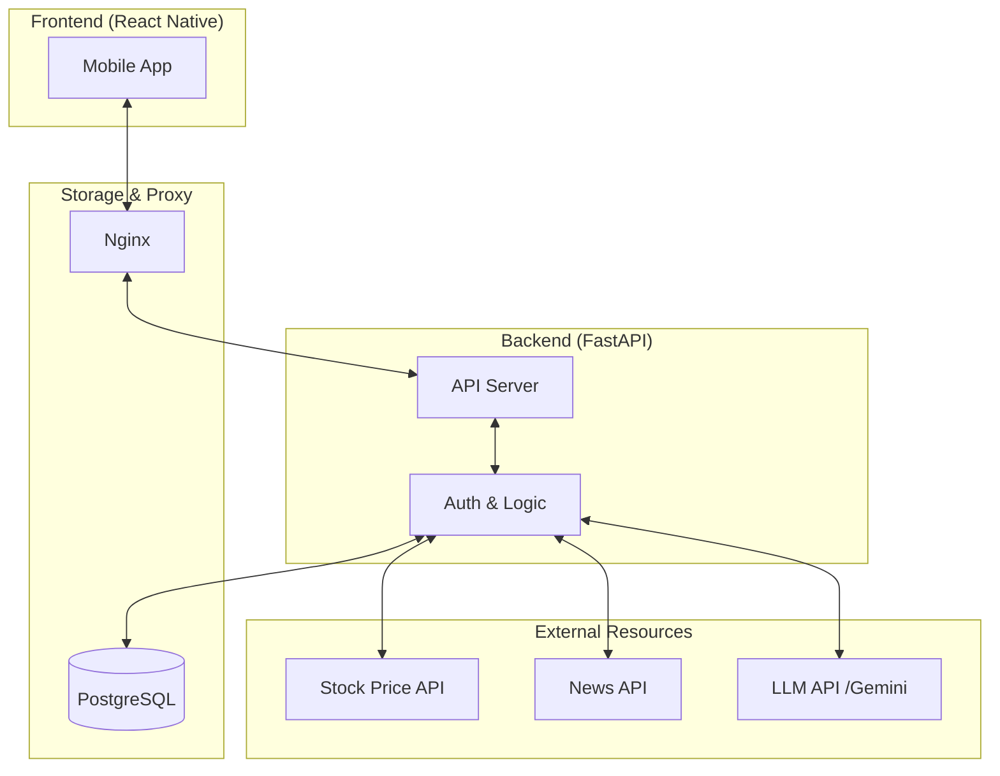

# StockFlow (스마트 투자 나침반)

주린이도 한눈에 자산을 파악하고, AI의 도움을 받아 똑똑한 투자 결정을 내릴 수 있도록 돕는 주식 대시보드 프로젝트입니다.

## 🎯 프로젝트 개요
* **목표:** 복잡한 정보 속에서 핵심을 짚어주는 투자 보조 도구.
* **성공 지표:** "일일이 뉴스를 검색하지 않고도 3분 안에 종목 이슈를 파악하고 투자 판단에 도움을 받는가?"

## 🛠️ 기술 스택 및 선정 이유
* **Backend (FastAPI):** Python 기반의 빠른 성능과 자동 Swagger 문서화 지원.
* **Frontend (React Native):** 언제 어디서든 확인 가능한 모바일 환경 제공.
* **Database (PostgreSQL):** 금융 데이터의 정확성과 무결성 보장.
* **Infra (Nginx, Docker):** 안정적인 배포 환경과 Reverse Proxy를 통한 서버 보안 구축.

## 🚀 개발 로드맵
### MVP (최소 기능 제품)
- **내 지갑 관리:** 보유 주식(종목명, 수량, 매수가) CRUD 구현.
- **실시간 수익률:** 시세 API 연동을 통한 평가 손익 및 수익률 계산.
- **포트폴리오 비중:** 자산 내 종목별 비중 시각화.

### 서비스 고도화
- **탐색:** 종목 검색 및 관심 종목 추가.
- **상세 정보:** PER, PBR, 배당률 등 재무제표 정보 연동.
- **AI 분석:** LLM API(Gemini) 활용 뉴스 3줄 요약 및 투자 심리 분석.

## 🏗️ 시스템 구조도


## 📂 파일 및 폴더 구조
```text
StockFlow/
├── backend/                # FastAPI 백엔드
│   ├── app/                # 어플리케이션 핵심 로직
│   │   ├── routers/        # API 엔드포인트 분리 (주식, 뉴스 등)
│   │   │   └── stocks.py   # 주식 관련 API 로직
│   │   ├── crud.py         # DB 생성/읽기/수정/삭제 로직
│   │   ├── database.py     # SQLAlchemy DB 연결 설정
│   │   ├── main.py         # 백엔드 서버 시작점
│   │   ├── models.py       # DB 테이블(모델) 정의
│   │   ├── schemas.py      # Pydantic 데이터 검증 모델
│   │   └── test_api.py     # API 테스트 스크립트
│   ├── Dockerfile          # 백엔드 컨테이너 빌드 설정
│   └── requirements.txt    # 설치 필요한 라이브러리 목록 (yfinance, fastapi 등)
├── frontend/               # React Native (Expo) 프론트엔드
│   ├── src/                # 소스 코드 폴더
│   ├── App.js              # 앱 메인 화면 및 로직
│   ├── package.json        # 프론트엔드 의존성 관리
│   └── styles.js           # 앱 스타일링 설정
├── infra/                  # 인프라 및 배포 설정
│   ├── nginx.conf          # Nginx 리버스 프록시 설정 (보안)
│   └── docker-compose.yml  # 전체 컨테이너(API, DB, Nginx, Tunnel) 통합 관리
├── .env                    # 환경 변수 (DB 비번, API 키 등 - 로컬 전용)
├── .gitignore              # Git 제외 목록 (노드 모듈, .env 등)
└── README.md               # 프로젝트 설명서

## 📋 버전 관리

| 구분 | 도구 | 버전 | 비고 |
| :--- | :--- | :--- | :--- |
| **Backend** | Python | 3.11 | |
| **Backend** | FastAPI | 0.110.0 | |
| **Backend** | Uvicorn | 0.29.0 | |
| **Frontend** | Node.js | v20.x (LTS) | |
| **Frontend** | React Native | 최신 안정 | package.json 참조 |
| **Infra** | Docker | 최신 | |